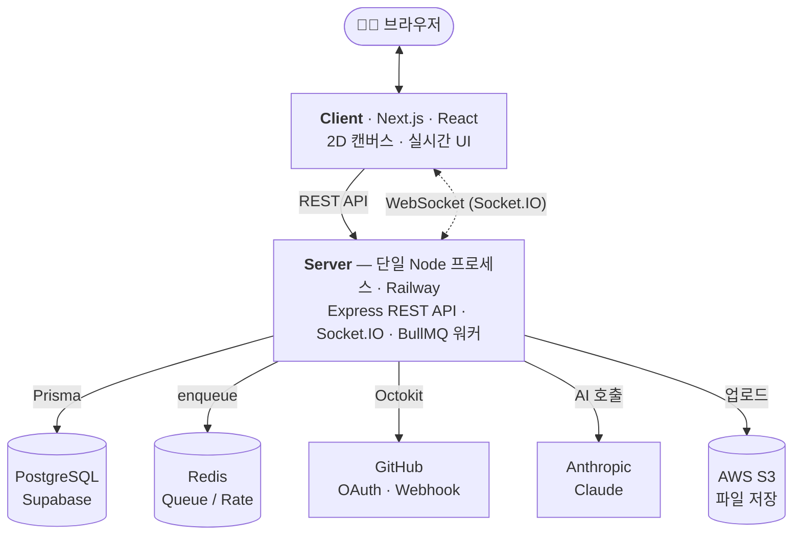

<div align="center">


# 🦉 토닥윗미 (Todak With Me)

### 개발자를 위한 다정하고 똑똑한 **올인원 협업 공간**

흩어진 협업 도구를 하나로 모으고, 부엉이 **토닥이**가 팀의 소통을 돕습니다.<br/>
가상 오피스에서 함께 일하고, AI가 회의록을 정리하며, GitHub가 실시간으로 연결됩니다.

<br/>


**데브코스 웹 풀스택 9기 · 최종 프로젝트 3팀 「토닥이들」**

📹 [시연 영상](https://youtu.be/UpVpmfKZ7qA) &nbsp;·&nbsp; 📑 [발표 자료](https://github.com/user-attachments/files/29086810/03._._._.pdf) &nbsp;·&nbsp; 🚀 [서비스 바로가기](https://webfull-9-10-todak-client.vercel.app/)

</div>

<br/>

## 📑 목차

- [기획 배경](#-기획-배경)
- [주요 기능](#-주요-기능)
- [기술 스택](#-기술-스택)
- [시스템 아키텍처](#-시스템-아키텍처)
- [성능 최적화](#-성능-최적화)
- [안정성 & 보안](#-안정성--보안)
- [프로젝트 구조](#-프로젝트-구조)
- [시작하기](#-시작하기)
- [배포](#-배포)
- [팀 소개](#-팀-소개)
- [컨벤션](#-컨벤션)

<br/>

## 🎯 기획 배경

> "협업, 생각보다 너무 번거롭지 않나요?"

팀 프로젝트를 하다 보면 **가상 오피스(zep)·메신저(Slack)·코드(GitHub)** 를 동시에 띄워 두게 됩니다.
회의가 끝나면 회의록을 따로 정리하고, PR·이슈가 올라와도 일일이 팀원에게 알려야 하죠.
도구가 흩어져 있다 보니 정작 **개발에 집중하기 어려웠습니다.**

그래서 찾아봤지만, **개발팀에 딱 맞는 올인원 협업 서비스는 없었습니다.**

| 서비스            | 한계                                               |
| :---------------- | :------------------------------------------------- |
| Jira / Notion     | 팀원의 **현재 상태(집중·회의·부재)** 를 알 수 없음 |
| zep (가상 오피스) | 무겁고 **개발에 특화되지 않음**                    |
| Discord / Slack   | 메시징 중심 — 상태 공유·목표 관리가 약함           |
| Linear            | 이슈 관리는 깔끔하지만 **회의록 기능이 없음**      |

**→ 그래서 저희가 직접 만들었습니다.** 개발자가 **단 하나의 창**만 열어둔 채로, 더 편하고 다양하게 협업할 수 있도록.

<br/>

## ✨ 주요 기능

### 🏠 2D 가상 워크스페이스

- 내 캐릭터로 가상 오피스에 **출근**, 팀원의 **위치와 상태(집중 · 휴식 · 회의 · 자리비움)** 를 한눈에 확인
- 캐릭터가 회의실 영역에 들어가면 **충돌 감지**로 자동 입장 / 퇴장 처리
- Pixi.js 기반 실시간 캔버스 렌더링

### 💬 실시간 채팅 & 파일 공유

- 이모지 리액션, 드래그&드롭 **파일 전송(AWS S3)**, **프라이빗 채팅** 채널
- Socket.IO 기반 양방향 실시간 통신

### 🤖 AI 회의록

- 회의가 끝나면 **Claude AI**가 대화를 분석해 **회의록 자동 생성** (참가자 · 주요 논의 · 결정 사항)
- ✨ **AI 다듬기** — 마음에 들 때까지 요청을 반영해 **원하는 버전으로 재작성**
- 회의 내용에서 **할 일을 GitHub 이슈 초안**으로 만들어 검토 후 바로 등록

### 🔗 GitHub 실시간 연동

- GitHub OAuth 로그인, **웹훅으로 PR · Issue · Push 이벤트 실시간 수신**
- 토닥윗미 안에서 PR/이슈 조회 · 상세 확인 · **승인/머지**까지 처리
- 이슈 ↔ Todo 자동 동기화

### 🦉 토닥이 알림

- PR 머지, 회의록 완성, 새 이슈 등 중요한 순간을 **캐릭터 토닥이**가 실시간으로 전달
- 클릭 한 번으로 해당 PR · 이슈로 바로 이동

<br/>

## 🛠 기술 스택

**Frontend**


**Backend**


**Database · Infra · AI**


**개발 · 품질**


<br/>

## 🏗 시스템 아키텍처



- **REST + WebSocket** 이원화: 일반 요청은 REST, 실시간 상태·채팅은 WebSocket
- **단일 Node 프로세스** 안에서 API · 실시간 통신 · 비동기 워커(BullMQ)를 함께 운영
- 회의록 생성/깃허브 동기화처럼 무거운 작업은 **큐로 분리**해 사용자 응답 지연 최소화

<br/>

## 📖 API 문서

**Swagger UI** 로 모든 엔드포인트를 확인하고 브라우저에서 바로 호출해볼 수 있습니다.

| 환경    | 주소                                                       |
| :------ | :--------------------------------------------------------- |
| 🔵 배포 | https://webfull910todak-production.up.railway.app/api-docs |
| 🖥 로컬 | http://localhost:4000/api-docs                             |

- OpenAPI 스펙은 **`zod-to-openapi`** 로 Zod 스키마에서 자동 생성됩니다. (JSON: `/api/docs/openapi.json`)

<br/>

## ⚡ 성능 최적화

실측 기반으로 병목을 찾아 개선했습니다.

| 항목                                       | Before    | After        | 개선         |
| :----------------------------------------- | :-------- | :----------- | :----------- |
| **DB 인덱스** — `room_member` 포인트 조회  | 19.236 ms | **0.036 ms** | **534× ⚡**  |
| **DB 인덱스** — 룸별 최신순 조회           | 18.381 ms | **0.041 ms** | **448× ⚡**  |
| **쿼리 병렬화** (`Promise.all`) — 요청당   | ~325 ms   | **~163 ms**  | **약 2× ⚡** |
| **이미지 최적화** (PNG → WebP) — 초기 로딩 | 32.89 s   | **3.8 s**    | **8.6× ⚡**  |
| **이미지 최적화** — 에셋 용량              | 9.14 MB   | **1.36 MB**  | **−85%**     |

> DB 인덱스는 20만 행 시뮬(`EXPLAIN ANALYZE`)로 검증했고, 데이터가 커질수록 Postgres가 자동으로 Index Scan으로 전환됩니다.
> 원격 DB라 네트워크 왕복 비용이 큰 환경에서, 순차 await를 `Promise.all` 병렬 실행으로 바꿔 큰 효과를 봤습니다.

<br/>

## 🔒 안정성 & 보안

흔히 놓치기 쉬운 문제를 **회피하지 않고 정면으로** 해결했습니다.

| 예상 위협                    | 해결                                                            |
| :--------------------------- | :-------------------------------------------------------------- |
| 위조된 Webhook 요청          | **HMAC 서명 검증** (`timingSafeEqual`) 으로 차단                |
| 무차별 인증 요청(브루트포스) | **Redis Lua 스크립트**로 원자적 Rate Limiting                   |
| Access Token 탈취            | **Refresh Token Rotation** 으로 무력화                          |
| 재배포 중 작업 유실          | **Graceful Shutdown** 순서 제어(HTTP→소켓→워커→DB→Redis)로 보존 |

- 비동기 작업은 **BullMQ 재시도 정책 + stuck 작업 sweeper** 로 운영 안정성 확보
- **유닛 · 통합 테스트 25개 · 200여 개 케이스** 로 핵심 로직을 검증
- `dependency-cruiser` 로 의존성 규칙 검사, Husky + lint-staged 로 커밋 단위 품질 관리

<br/>

## 📂 프로젝트 구조

```
.
├── apps/
│   ├── client/        # Next.js 16 · React 19 (Render 배포)
│   │   └── src/
│   │       ├── app/         # App Router (room, auth ...)
│   │       ├── services/    # API 클라이언트 (axios · React Query)
│   │       ├── store/       # Zustand 전역 상태
│   │       └── lib/         # socket, device 등
│   └── server/        # Express API (Railway 배포)
│       └── src/
│           ├── api/         # REST 라우트 (auth, rooms, minutes, github, webhooks ...)
│           ├── socket/      # Socket.IO 핸들러 (chat, room, meeting, minutes ...)
│           ├── services/    # 비즈니스 로직 (anthropic, webhook, minutes ...)
│           ├── jobs/        # BullMQ 큐 · 워커
│           ├── middleware/  # 인증 · rate limit · 검증
│           └── prisma/      # schema.prisma · migrations
├── .github/           # CI 워크플로 · PR 템플릿
└── pnpm-workspace.yaml
```

<br/>

## 🚀 시작하기

### 요구 사항

- **Node.js** ≥ 20.19 (권장 22.x) · **pnpm** ≥ 9

### 설치 & 환경 변수

```bash
pnpm install

cp apps/server/.env.example apps/server/.env
# apps/server/.env 값을 팀 Supabase / Railway / GitHub / Anthropic / AWS 키에 맞게 수정
```

### 개발 서버

```bash
pnpm dev          # client + server 동시 실행
pnpm dev:client   # client 만
pnpm dev:server   # server 만
```

### 데이터베이스 (Prisma 7)

```bash
pnpm db:generate  # Prisma Client 생성
pnpm db:migrate   # 마이그레이션
pnpm db:studio    # Prisma Studio
```

### 테스트

```bash
pnpm test              # 유닛 테스트 (Vitest)
pnpm test:integration  # 통합 테스트 (임베디드 PostgreSQL)
```

<details>
<summary>전체 스크립트 (루트)</summary>

| 명령                                                                    | 설명                                        |
| :---------------------------------------------------------------------- | :------------------------------------------ |
| `pnpm dev`                                                              | client + server 동시 개발 모드              |
| `pnpm build`                                                            | server 빌드 / `build:client` 로 client 빌드 |
| `pnpm test` · `pnpm test:integration`                                   | 유닛 / 통합 테스트                          |
| `pnpm lint` · `pnpm lint:fix`                                           | ESLint                                      |
| `pnpm format` · `pnpm format:check`                                     | Prettier                                    |
| `pnpm depcruise`                                                        | 의존성 규칙 검사                            |
| `pnpm db:generate` · `db:migrate` · `db:push` · `db:studio` · `db:seed` | Prisma                                      |

</details>

<br/>

## 🚢 배포

| 대상             | 플랫폼              | 비고                                                                                    |
| :--------------- | :------------------ | :-------------------------------------------------------------------------------------- |
| Client (Next.js) | **Vercel**          | https://webfull-9-10-todak-client.vercel.app                                            |
| Server (Express) | **Railway**         | Health check: `GET /api/health` · API 문서 `GET /api-docs` · `apps/server/railway.toml` |
| Database         | **Supabase**        | PostgreSQL (Pooling URL)                                                                |
| Queue / Cache    | **Redis (Railway)** | BullMQ · Rate Limit                                                                     |
| File Storage     | **AWS S3**          | 채팅 첨부파일 (Presigned URL)                                                           |

<br/>

## 👥 팀 소개

<table>
  <tr>
    <td align="center" width="160">
      <br/>
      <b>강영아</b><br/><sub>Backend</sub>
    </td>
    <td align="center" width="160">
      <br/>
      <b>김가영</b><br/><sub>Backend</sub>
    </td>
    <td align="center" width="160">
      <br/>
      <b>신상호</b><br/><sub>Backend</sub>
    </td>
    <td align="center" width="160">
      <br/>
      <b>송정화</b><br/><sub>Frontend</sub>
    </td>
    <td align="center" width="160">
      <br/>
      <b>이예은</b><br/><sub>Frontend</sub>
    </td>
    <td align="center" width="160">
      <br/>
      <b>이중훈</b><br/><sub>Frontend</sub>
    </td>
  </tr>
  <tr>
    <td align="center"><sub>Auth · Room · Repo · Todo<br/>소켓 기본 구조 · 인가/보안</sub></td>
    <td align="center"><sub>Chat · Meeting · PrivateRoom<br/>Infra (CI · BullMQ · 종료처리)</sub></td>
    <td align="center"><sub>AI 회의록 · Notification<br/>GitHub Webhook</sub></td>
    <td align="center"><sub>2D 가상 공간 · 캐릭터<br/>렌더링 최적화</sub></td>
    <td align="center"><sub>AI 회의록 · 실시간 채팅<br/>이슈 등록기</sub></td>
    <td align="center"><sub>GitHub 인증 · PR 관리<br/>설정 · 사용자 흐름</sub></td>
  </tr>
</table>

> 💡 `<!-- 사진 URL -->` 부분에 각자 사진(또는 GitHub 아바타 `https://github.com/<id>.png`)과 GitHub 링크를 넣어주세요.

<br/>

## 🤝 컨벤션

### 📌 커밋 메시지 — Conventional Commits

`type: subject` 형식을 사용합니다. (예: `feat: GitHub OAuth 콜백 추가`)
`commit-msg` 훅에서 **commitlint** 가 자동 검증하며, 규칙을 어기면 커밋이 막힙니다.

| type     | 설명                | type       | 설명                              |
| :------- | :------------------ | :--------- | :-------------------------------- |
| `feat`   | 새로운 기능         | `refactor` | 코드 리팩토링                     |
| `fix`    | 버그 수정           | `comment`  | 주석 추가/변경                    |
| `design` | UI 디자인 수정      | `rename`   | 파일/폴더명 수정·이동             |
| `test`   | 테스트 코드         | `remove`   | 파일 삭제                         |
| `chore`  | 빌드·환경 설정 변경 | `style`    | 포맷·세미콜론 등 (로직 변화 없음) |
| `docs`   | 문서 수정           | `security` | 보안 취약점 해결                  |

> 규칙: `subject` 필수 · 제목 **50자** 이내 · 본문 한 줄 **72자** 이내

### 🌿 브랜치 전략

- `main` — 배포(릴리스) 브랜치
- `develop` — 통합 개발 브랜치 (기능 PR이 모이는 곳)
- `feature/<기능명>` · `fix/<수정명>` — 작업 브랜치 → `develop` 으로 PR

### 🔁 Pull Request

- 템플릿(**개요 · 작업 내용 · 변경 사항 · UI 스크린샷 · 패키지 설치 · 관련 이슈**) 작성
- PR 제목도 커밋과 동일한 Conventional Commits 규칙으로 검사 (squash 머지 시 제목이 곧 커밋이 되므로)
- **CI 통과 + 리뷰 승인** 후 머지

### 🎨 코드 스타일

- **ESLint** + **Prettier** — `pre-commit` 훅에서 `lint-staged` 로 변경 파일만 자동 검사·포맷
- **dependency-cruiser** 로 모듈 간 의존성 규칙(순환 의존 등) 검사
- 클라이언트/서버 모두 **TypeScript strict** + `tsc --noEmit` 타입 체크

### ✅ CI 파이프라인 (GitHub Actions)

PR이 열리면 다음 검사가 자동 실행됩니다.

| 워크플로       | 검사 항목                                                                                                         |
| :------------- | :---------------------------------------------------------------------------------------------------------------- |
| **CI**         | 포맷 체크 · 린트 · 타입체크(server·client) · dependency-cruiser · 유닛 테스트 · 통합 테스트 · 빌드(server+client) |
| **Commitlint** | 커밋 메시지 · PR 제목 규칙 검사                                                                                   |
| **Gitleaks**   | 시크릿(키·토큰) 유출 스캔                                                                                         |

<br/>

<div align="center">

**🦉 토닥윗미와 함께, 개발 협업의 모든 것을 한 곳에서.**

<sub>프로그래머스 데브코스 웹 풀스택 9기 · 최종 프로젝트 3팀 「토닥이들」</sub>

</div>
