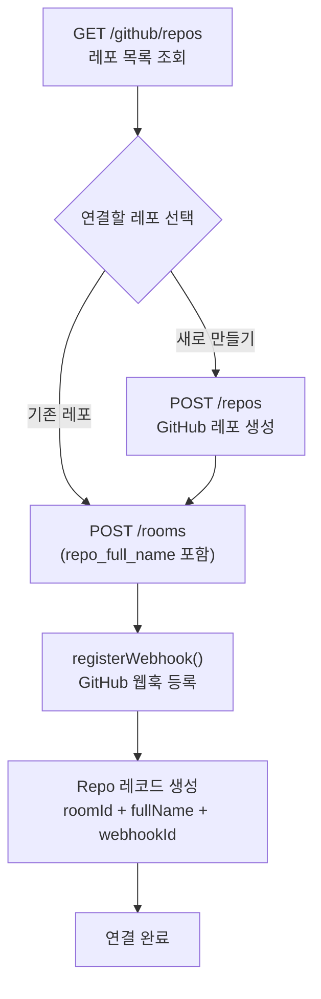

# GitHub 레포지토리 연결 흐름 정리

> 토닥(Todak) 백엔드에서 GitHub 레포지토리가 어떻게 룸과 연결되고, 어떤 경우에 해제되는지 정리한 문서입니다.
> 팀 논의용 자료이며, 마지막에 "재연결" 기능을 어떻게 만들/수정하면 좋을지 제안을 담았습니다.

---

## 1. 핵심 개념

- 레포 연결은 **독립된 API가 아니라 "룸 생성" 과정에 포함**되어 있다.
- DB 상 `Repo`는 `Room`에 **1:1로 종속**된다 (`Repo.roomId`).
- 한 번 룸에 연결된 레포는 **룸이 살아있는 동안 교체/해제 불가** (현재 미구현).
- 같은 레포(`fullName`)는 **동시에 하나의 룸에만** 연결될 수 있다.

---

## 2. 연결(Connect) 흐름

### 진입점: `POST /rooms`

| 구분        | 위치                                                               |
| ----------- | ------------------------------------------------------------------ |
| 라우트      | `apps/server/src/api/rooms/rooms.routes.ts` (`POST /`)             |
| 컨트롤러    | `rooms.controller.ts` → `createRoomHandler`                        |
| 서비스      | `apps/server/src/services/rooms.service.ts` → `createRoom()`       |
| GitHub 연동 | `apps/server/src/services/github.service.ts` → `registerWebhook()` |

### 요청 바디 (`CreateRoomSchema`)

```json
{
  "name": "룸 이름",
  "repo_full_name": "owner/repo",
  "max_members": 6
}
```

### `createRoom()` 처리 순서

1. **중복 검사** — 같은 `repo_full_name`을 쓰는 `Repo`가 이미 있으면 `REPO_ALREADY_IN_USE` 에러.
2. **웹훅 등록** — `registerWebhook(accessToken, owner, repo)` 호출.
   - GitHub에 `issues`, `pull_request`, `push` 이벤트 웹훅을 생성한다.
   - Admin 권한이 없으면 `REPO_ADMIN_REQUIRED`, 레포가 없으면 `REPO_NOT_FOUND`.
   - 동일 URL 웹훅이 이미 있으면(422) 기존 웹훅 ID를 재사용한다.
   - 성공 시 `webhookId` 반환.
3. **트랜잭션으로 일괄 생성**
   - `Room` 생성 (초대 코드 발급 포함)
   - `Repo` 생성 (`roomId`, `fullName`, `webhookId` 저장) ← **실제 "연결" 지점**
   - 방장 `RoomMember` 생성
   - 회의실(PrivateRoom) 2개 자동 생성

### 연결 전 사용하는 보조 API

| API                 | 설명                                           |
| ------------------- | ---------------------------------------------- |
| `GET /github/repos` | 내 GitHub 레포 목록 조회 (연결할 레포 선택용)  |
| `POST /repos`       | GitHub에 새 레포 생성 (생성만, 룸 연결은 별도) |



---

## 3. 해제(Disconnect) 흐름

> ⚠️ 현재 **"레포만 따로 해제"하는 API는 없다.** 웹훅 해제는 **룸이 사라질 때만** 일어난다.

### 웹훅이 해제되는 경우 (`unregisterWebhook` 호출)

| 트리거 API                  | 조건                      | 동작                                                      |
| --------------------------- | ------------------------- | --------------------------------------------------------- |
| `DELETE /rooms/:roomId`     | 방장만 가능               | `purgeRoom()` → 웹훅 해제 + 룸/레포/관련 데이터 전부 삭제 |
| `POST /rooms/:roomId/leave` | **마지막 멤버**가 나갈 때 | `purgeRoom()` 으로 위와 동일하게 정리                     |

`purgeRoom()` (`rooms.service.ts`)에서:

- 웹훅 해제(`unregisterWebhook`)를 먼저 시도한다.
- 해제 실패해도(이미 GitHub에서 삭제됐거나 등) 룸 삭제는 계속 진행한다 (best-effort).

### `DELETE /repos/:repoId` 는 "해제"가 아니다

- 이 API는 `octokit.repos.delete`로 **GitHub 레포 자체를 영구 삭제**하는 파괴적 동작이다.
- 방장만 가능하며, DB의 `Repo` 레코드도 함께 삭제한다.
- 재연결과는 무관하므로 혼동 주의.

---

## 4. 현재 한계 (= 정리/논의가 필요한 지점)

1. **재연결 API 부재** — 룸은 그대로 두고 레포를 다시 연결하거나 다른 레포로 교체하는 경로가 없다.
2. **레포만 분리하는 API 부재** — 웹훅 해제는 룸 삭제와 강하게 묶여 있다.
3. **웹훅이 외부에서 삭제된 경우 복구 불가** — GitHub에서 누군가 웹훅을 지우면, 코드상으로 다시 거는 방법이 없다 (룸을 지웠다 다시 만드는 수밖에 없음).

---

## 5. 개선 제안 (구현/수정 방향)

아래 두 가지를 추가하면 "연결 해제 → 재연결" 시나리오를 깔끔하게 지원할 수 있다. 둘 다 **방장 권한** 기준으로 두는 것을 권장.

### (A) 레포 연결 해제 — `DELETE /rooms/:roomId/repo`

- 룸은 유지하고 레포 연결만 끊는다.
- 동작: `unregisterWebhook()` 호출 → `Repo` 레코드 삭제(또는 `webhookId`만 null 처리).
- 주의: 연결된 Todo의 `githubIssueNumber` 등 기존 데이터를 어떻게 처리할지 정책 결정 필요
  (그대로 남길지, 끊긴 상태로 표시할지).

### (B) 레포 재연결/교체 — `PUT /rooms/:roomId/repo`

```json
{ "repo_full_name": "owner/new-repo" }
```

- 동작 순서(트랜잭션 권장):
  1. 기존 `Repo`가 있으면 기존 웹훅 해제(`unregisterWebhook`) — best-effort.
  2. 새 레포 중복 검사(`REPO_ALREADY_IN_USE`).
  3. 새 레포에 웹훅 등록(`registerWebhook`).
  4. `Repo` 레코드 upsert (없으면 생성, 있으면 `fullName`/`webhookId` 갱신).
- 기존 `createRoom()`의 2~3단계 로직을 **재사용 가능한 함수로 추출**해서 `createRoom`/재연결 양쪽에서 쓰는 것을 추천 (중복 제거 + 일관성).

### 공통 고려 사항

- **권한**: 레포 연결은 룸 전체에 영향 → 방장(`isHost`)만 허용.
- **멱등성**: 웹훅 등록은 이미 422(중복) 처리가 있고, 해제는 404를 무시하므로 재시도에 안전한 편.
- **트랜잭션 경계**: GitHub API 호출(외부)과 DB 트랜잭션을 어떻게 묶을지 주의.
  외부 호출 실패 시 DB가 롤백되도록 순서를 설계해야 함 (현재 `createRoom`은 웹훅 등록 후 DB 트랜잭션 진행).
- **데이터 정합성**: 레포를 교체하면 기존 레포 기준으로 만들어진 Todo/통계 캐시(`statsCache`)를 초기화할지 결정 필요.

---

## 참고 파일

- 룸/레포 연결: `apps/server/src/services/rooms.service.ts`
- GitHub 연동(웹훅·이슈·PR): `apps/server/src/services/github.service.ts`
- 레포 생성/삭제: `apps/server/src/services/repos.service.ts`
- 웹훅 수신 처리: `apps/server/src/services/webhook.service.ts`
- 라우트: `apps/server/src/api/rooms/rooms.routes.ts`, `apps/server/src/api/repos/repos.routes.ts`, `apps/server/src/api/github/github.routes.ts`
